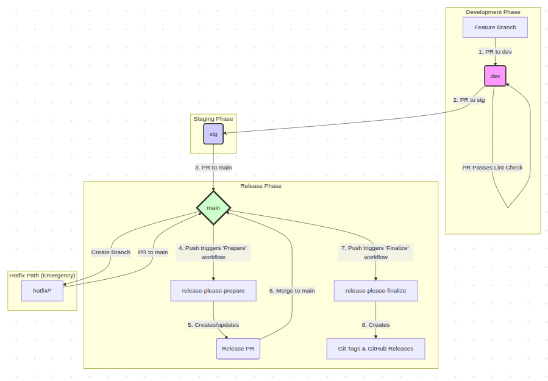
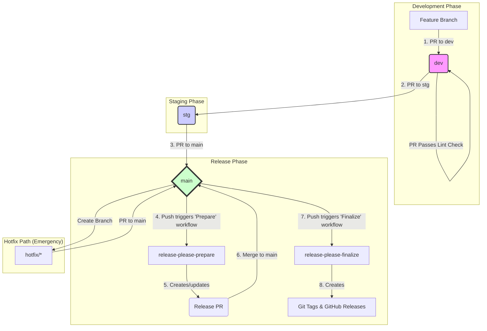

# Release Please PoC: Automated Versioning System

## Executive Summary: The Business Value of Automation

This document details the automated versioning and release system implemented for this project. This summary is intended for all stakeholders, including product managers, technical directors, and team leads, to clarify the purpose and business value of this engineering initiative.

### The Problem We Solved

Previously, the process of releasing new software versions was largely manual. This approach presented several business risks:
*  **Slow Time-to-Market:** Manual procedures were time-consuming, delaying the delivery of new features and critical bug fixes to our users.
*  **High Risk of Human Error:** Each manual step in the release process was a potential point of failure, increasing the chances of deploying unstable code to production.
*  **Lack of Transparency:** It was difficult to create a clear, auditable history of what specific changes were included in each version, complicating planning and support.

### Our Solution

We have implemented a robust, two-phase automated system built around industry-standard tools and practices (`release-please` and `Conventional Commits`). This system fully automates version management, changelog generation, and the creation of release artifacts. It enforces a strict and predictable development workflow, ensuring that every change is tracked and validated.

### Business Impact & Value

1. **Increased Agility & Faster Delivery:** By automating routine tasks, we drastically reduce the "lead time" for releases. This allows us to deliver value to our customers faster, whether it's a new feature or a critical security patch.
2. **Enhanced Reliability & Stability:** Automating the process eliminates a whole class of human errors. This leads to more reliable deployments, higher uptime, and greater user trust in our product.
3. **Complete Transparency & Auditability:** Every release is now automatically accompanied by a detailed changelog. This provides crystal-clear visibility for all stakeholders. Product managers can easily track feature delivery, and support teams can instantly see which bug fixes are included in a version. This creates a fully auditable release history.
4. **Improved Developer Focus & Productivity:** Our engineers can now focus on their primary task—building great software—instead of being burdened by complex and error-prone release procedures. This boosts morale and allows us to innovate more effectively.

---

## 1. Developer Quick Start

This section contains everything a developer needs to know to start working on the project.

### 1.1. Local Setup: Commit Message Linting

To ensure a consistent Git history and enable our automation, this project enforces commit message validation on your local machine using `Husky` and `Commitlint`.

**Goal:**
*  **Error Prevention:** Blocks commits with improperly formatted messages before they are created.
*  **Automation Foundation:** Guarantees that all commits adhere to the standard our release tools rely on.

**How to Activate:**
To activate this system on your local machine, follow these one-time setup steps:
1. Install [Node.js](https://nodejs.org/) (version 16+ is recommended).
2. Run the following command in the project's root directory:
  ```bash
  npm install
  ```
This command will download all necessary development tools and automatically configure the Git hooks.

### 1.2. The Golden Rule: Conventional Commits

All commit messages and Pull Request titles in this project **MUST** follow the [Conventional Commits specification v1.0.0](https://www.conventionalcommits.org/en/v1.0.0/). This is not a style preference; it is the engine that powers our entire release automation system.

#### Commit Structure

The basic structure of a commit message is as follows:
```
<type>(<scope>): <subject>
<BLANK LINE>
[optional body]
<BLANK LINE>
[optional footer(s)]
```

#### Common Types

While the specification allows for many types, we primarily use the following:
*  `feat`: A new feature for the user.
*  `fix`: A bug fix for the user.
*  `perf`: A code change that improves performance.
*  `build`: Changes that affect the build system or external dependencies.
*  `ci`: Changes to our CI configuration files and scripts.
*  `docs`: Documentation only changes.
*  `refactor`: A code change that neither fixes a bug nor adds a feature.
*  `style`: Changes that do not affect the meaning of the code (white-space, formatting, etc).
*  `test`: Adding missing tests or correcting existing tests.
*  `chore`: Other changes that don't modify `src` or `test` files.

#### Impact on Versioning

The `type` of the commit directly determines how the version number will be incremented:
*  `feat` results in a **minor** version bump (e.g., `1.2.3` -> `1.3.0`).
*  `fix` or `perf` result in a **patch** version bump (e.g., `1.2.3` -> `1.2.4`).
*  A `!` after the type (e.g., `feat!`) or a `BREAKING CHANGE:` footer results in a **major** version bump (e.g., `1.2.3` -> `2.0.0`).

#### Project-Specific Rules

Our local validation (`.commitlintrc.json`) enforces these additional key rules:
1. **A `scope` is mandatory** and must be one of the predefined values: `project`, `activity`, `payment`, `activity-schema`, `payment-schema`.
2. **The header line must not exceed 72 characters.**

---

## 2. Our Development Workflow

This section describes the standard process for contributing code to the project. Adhering to this workflow is essential for maintaining code stability and enabling our automated release system.

### 2.1. Branching Strategy

We use a permanent, multi-stage branching model. Code flows in one direction, from less stable to more stable branches.

`feature/*` -> `dev` -> `stg` -> `main`

*  `main`: This branch represents the current production code. It is the most stable branch. Direct pushes are forbidden.
*  `stg` (Staging): A pre-production branch used for final regression testing. It should be a stable reflection of what will become the next release.
*  `dev` (Development): The main integration branch for all new features. This is an active, fast-moving branch.
*  `feature/*` or `fix/*`: Short-lived branches created from `dev` for developing new features or non-critical bug fixes.

### 2.2. Feature Lifecycle (Developer's Guide)

This is the step-by-step process to get your work from an idea to a merged feature. It defines our branching strategy and merge procedures.

#### **Branching Flow:** `feature/*` -> `dev` -> `stg` -> `main`

---

#### **Step 1: Create a Feature Branch**
Always start by creating a new branch from the latest version of `dev`.
```bash
git checkout dev
git pull
git checkout -b feature/my-new-feature
```

---

#### **Step 2: Develop and Commit**
Do your work on the feature branch. Create small, logical commits. Remember to follow the **Conventional Commits** standard for every commit message.

---

#### **Step 3: Create a Pull Request to `dev`**
When your feature is complete, push your branch to the repository and open a Pull Request (PR) targeting the `dev` branch.

**The title of your Pull Request MUST also follow the Conventional Commits standard.** This is critical because this title will become the final commit message after squashing.

---

#### **Step 4: Code Review and Merge to `dev`**
Your PR will automatically trigger several status checks. It must be approved by at least one other team member and all status checks must pass.

*  **Merge Strategy:** Use **"Squash and merge"**. This collapses all your feature commits into a single, clean commit on the `dev` branch.

---

#### **Step 5 (for Release Managers): Promote to Staging (`stg`)**
Once a set of features in `dev` is ready for regression testing, a Release Manager creates a Pull Request from `dev` into `stg`.

*  **Merge Strategy:** Use **"Create a merge commit"**.
*  **Action Required: Set Commit Message to Suppress Noise**
  When merging, you **MUST** edit the commit message to use the `chore(release)` format. This is a critical step to prevent merge commits from "polluting" the final changelog.
  ```
  chore(release): Promote dev to stg
  ```
---

#### **Step 6 (for Release Managers): Promote to Production (`main`)**
After successful testing on `stg`, a Pull Request is created from `stg` into `main`.

*  **Merge Strategy:** Use **"Create a merge commit"**.
*  **Action Required: Set Commit Message to Suppress Noise**
  Use the same `chore(release)` format for the merge commit message.
  ```
  chore(release): Promote stg to main
  ```
---

#### **Step 7: Automation Takes Over (`release-please`)**
Once the merge commit from `stg` lands in `main`, our automated release system takes over. You do not need to take any further action.
1. The `release-please` workflow triggers.
2. It analyzes all the underlying `feat`, `fix`, and `perf` commits that were promoted (it will correctly ignore the `chore(release)` commits).
3. It automatically creates a new **"Release PR"**. This PR will contain the updated version numbers and a generated `CHANGELOG.md`.
4. After this Release PR is reviewed and merged, the system will automatically create the final Git tags and GitHub Releases.ch.

**Step 6: What Happens Next? (Automation Takes Over)**
Once your PR is merged into `dev`, your work is officially part of the next release cycle. The automated system will eventually pick up your changes, include them in a "Release PR", and they will proceed through `stg` to `main` according to the release schedule. You do not need to take any further action.

---

## 3. System Architecture (Advanced)

<details>
 <summary>Click to expand for a deep dive into the CI/CD and Release Automation architecture.</summary>

 ### 3.1. Branch Protection via Rulesets

To enforce our workflow and prevent common errors, this repository uses GitHub's **Rulesets** feature, configured under **`Settings > Branches > Rulesets`**. This modern system provides technical guarantees for our development process. We have three active rulesets, each targeting a specific branch.

#### Ruleset: `main` (Production Branch)

**Objective:** Maximum stability and auditability. This branch is a direct reflection of our production environment.

| Rule | Configuration | REASON |
| :--- | :--- | :--- |
| **Require a pull request** | Enabled | Ensures all changes go through a formal review process. Direct pushes are blocked. |
| **Require status checks to pass**| Enabled | Guarantees that code is only merged after all quality gates (linting, tests, builds) are green. |
| *Required Checks* | `Check PR Title`, *(future: `build`, `test`)* | Specifies exactly which checks are mandatory. |
| **Require branches to be up-to-date** | **Enabled** | **CRITICAL:** Prevents merging outdated PRs into `main`, avoiding race conditions and ensuring the PR was tested against the latest code. |
| **Block force pushes** | Enabled | Protects the integrity and history of the production branch. |
| **Restrict deletions** | Enabled | Prevents accidental deletion of the production branch. |
| **Merge Controls** | Block `Squash`, Block `Rebase` | **CRITICAL:** Only "Merge commit" is allowed. This preserves the clean, linear history coming from `stg` and `dev`. |

#### Ruleset: `stg` (Staging Branch)

**Objective:** Pre-production stability. This branch mirrors the rules of `main` to ensure the testing environment is as close to production as possible.

| Rule | Configuration | REASON |
| :--- | :--- | :--- |
| **Require a pull request** | Enabled | All code must be reviewed before entering the final testing stage. |
| **Require status checks to pass**| Enabled | Ensures only quality-checked code is deployed to staging. |
| *Required Checks* | Same as `main` | Consistency across environments. |
| **Require branches to be up-to-date**| **Enabled** | Ensures that `stg` is always based on the latest state of the code it's integrating. |
| **Block force pushes** | Enabled | Maintains a stable history for the staging environment. |
| **Merge Controls** | Block `Squash`, Block `Rebase` | **CRITICAL:** Only "Merge commit" is allowed, simulating the exact merge that will happen into `main`. |

#### Ruleset: `dev` (Development Branch)

**Objective:** Fast development velocity while ensuring a clean, feature-based commit history suitable for `release-please`.

| Rule | Configuration | REASON |
| :--- | :--- | :--- |
| **Require a pull request** | Enabled | Even on the development branch, all changes must be reviewed. |
| **Require status checks to pass**| Enabled | The `Check PR Title` check is the minimum quality gate. |
| *Required Checks* | `Check PR Title` | Ensures that the resulting squash commit will be understandable by `release-please`. |
| **Require branches to be up-to-date**| **Disabled** | **IMPORTANT:** This is intentionally disabled to increase workflow velocity on this highly active branch. Developers do not need to constantly rebase their feature branches. |
| **Block force pushes** | Enabled | Prevents history rewrites that could disrupt other developers' work. |
| **Merge Controls** | Block `Merge commit`, Block `Rebase`| **CRITICAL:** Only "Squash and merge" is allowed. This is mandatory to collapse all feature commits into one, clean conventional commit. |

#### 3.1.1. Verification Plan (Test Cases)

This section describes how to verify that our system architecture and protection rules work as expected. It serves as our Acceptance Test Plan.

##### T1: Core Branch Protections

| ID | Test Case | Action to Verify | Expected Result & Reason |
| :--- | :--- | :--- | :--- |
| **T1.1** | Direct Push is Blocked | From your local machine, run `git push origin HEAD:dev`. | **Push REJECTED.** Reason: The ruleset for `dev` prohibits direct pushes, requiring all changes to go through a Pull Request. |
| **T1.2** | Force Push is Blocked | Make a local commit, then run `git push --force origin HEAD:dev`. | **Push REJECTED.** Reason: The ruleset for `dev` has "Block force pushes" enabled to protect branch history integrity. |
| **T1.3**| Branch Deletion is Blocked | Run `git push origin --delete dev`. | **Push REJECTED.** Reason: The ruleset for `dev` has "Restrict deletions" enabled to prevent accidental loss of the branch. |
| **T1.4**| Merge is Blocked on Failed Check | Open a PR to `dev` with an invalid title (e.g., "my pr"). | The "Merge pull request" button is **DISABLED**. Reason: The required `Check PR Title` status check has failed. |

##### T2: Merge Strategy and Branch State Enforcement

| ID | Test Case | Action to Verify | Expected Result & Reason |
| :--- | :--- | :--- | :--- |
| **T2.1** | Enforce Squash on `dev` | Open a PR into `dev` with a valid title. After checks pass, click the "Merge" button dropdown. | The merge dialog **ONLY shows the "Squash and merge"** option. Other methods are blocked by the ruleset. |
| **T2.2** | Enforce Merge Commit on `stg`/`main` | Open a PR from `dev` into `stg`. After checks pass, click the "Merge" button dropdown. | The merge dialog **ONLY shows the "Create a merge commit"** option. Other methods are blocked. |
| **T2.3** | Outdated Branch Block on `stg`/`main`| Open a PR to `stg`. While it's open, merge another PR into `stg`. Return to the first PR. | The PR is now **BLOCKED**. The "Update branch" button appears. Reason: The ruleset requires branches to be up-to-date before merging. |
| **T2.4** | Outdated Branch Ignored on `dev` | Open a PR to `dev`. While it's open, merge another PR into `dev`. | The PR is **NOT BLOCKED** from merging. The "Update branch" button may appear, but merging is still possible. Reason: The `dev` ruleset intentionally disables the "require branches to be up-to-date" rule. |

##### T3: Branch Workflow Enforcement ("Gatekeeper" checks - *Future Enhancement*)

| ID | Test Case | Action to Verify | Expected Result & Reason |
| :--- | :--- | :--- | :--- |
| **T3.1** | Block Invalid Merge to `main` | Open a PR from a `feature/*` branch directly into `main`. | A `Gatekeeper` status check **FAILS**. The merge button is disabled. Reason: Only `stg` and `hotfix/*` branches are allowed to merge into `main`. |
| **T3.2** | Block Invalid Merge to `stg` | Open a PR from a `feature/*` branch directly into `stg`. | A `Gatekeeper` status check **FAILS**. The merge button is disabled. Reason: Only `dev` is allowed to merge into `stg`. |
| **T3.3** | Allow Valid Hotfix Merge to `main` | Open a PR from a `hotfix/*` branch into `main`. | The `Gatekeeper` status check **PASSES**. Merging is allowed. |

##### **T4: `release-please` Workflow Verification**

This is the most critical test suite to validate our automation logic.

| ID | Test Case | Action to Verify | Expected Result & Reason |
|:---|:---|:---|:---|
| **T4.1** | **Release PR is Auto-Updating** | 1. Ensure a "Release PR" is currently open. If not, trigger its creation by merging a `feat` or `fix` commit into `main`. <br> 2. **Do not merge the existing Release PR.** <br> 3. Create and merge a **new**, separate PR with a single commit (e.g., `fix(project): add a new test case`) into `main`. | The existing "Release PR" **is automatically updated** by the `release-please` bot. A new commit from the bot appears in the PR's history, and the `CHANGELOG.md` file now includes the "add a new test case" entry. <br><br> **Reason:** This proves our hypothesis that `release-please` correctly maintains a single, always-up-to-date release candidate. |
| **T4.2** | **Merge Commits are Ignored ("Noise-Cancelling")** | 1. Perform a full promotion cycle: `feature -> dev` (Squash), then `dev -> stg` (Merge Commit), and finally `stg -> main` (Merge Commit). <br> 2. **Crucially, use `chore(release): ...` messages** for the merge commits into `stg` and `main`. <br> 3. Let `release-please` create its "Release PR". | The final `CHANGELOG.md` in the Release PR **contains ONLY the `feat`/`fix` commits** from the original feature branches. It does **NOT** contain any `chore(release)` entries. <br><br> **Reason:** This proves our "noise-cancelling" strategy works, producing a clean, human-readable changelog. |

### 3.2. Automated Release System (release-please)

To automate versioning and release notes generation, this project uses Google's `release-please` tool. The system is built around a two-stage workflow that separates release preparation from finalization, providing a clear and auditable release process.

#### Stage 1: Release Preparation (The "Release PR")

This is the primary output of the preparation stage.

*  **What it is:** An automatically generated Pull Request created by the `release-please-prepare.yml` workflow.
*  **Trigger:** A push to the `main` branch (typically after a `stg -> main` merge).
*  **Action:** The workflow runs `release-please` which analyzes new commits since the last release.
*  **Automatic Updates:** If other PRs are merged into `main` while the Release PR is open, `release-please` will automatically update its PR to include the new changes, ensuring it's always up-to-date with the `main` branch.
*  **Result (The "Release PR"):**
  1. **`CHANGELOG.md`:** An auto-generated summary of all `feat`, `fix`, and `perf` commits.
  2. **`release-please-manifest.json`:** An update to the version numbers for all changed components.
*  **Purpose:** This PR serves as a "staging area" for the next release. The team can review the upcoming changes and version bumps before they are finalized.
*  **Action Required:** A developer must review and **merge** this PR into `main`.

#### Stage 2: Release Finalization (Git Tags & GitHub Releases)

This is the final output of the entire process.

*  **Trigger:** Merging the "Release PR" into the `main` branch.
*  **Action:** This second push to `main` triggers the `release-please-finalize.yml` workflow.
*  **Result:**
  1. **Git Tags:** For each component updated in the manifest, a corresponding, component-specific Git tag is created (e.g., `payment-v2.1.0`).
  2. **GitHub Releases:** A corresponding GitHub Release is published with the `CHANGELOG.md` notes for that version.
*  **Purpose:** To create immutable, point-in-time references for each released version, providing a clean and official release history.
*  **Action Required:** None. This stage is fully automated.

#### Configuration Files Overview

The system is configured via the following files in the repository root:

*   **`release-please-config.json` & `release-please-manifest.json`**: These two files define the components of the monorepo and track their current versions. They are the "brain" of the release process.

*   **`.github/workflows/`**: This directory contains the GitHub Actions that drive the process:
    *   **`lint-pr-title.yml`**: This workflow runs on every Pull Request to enforce the Conventional Commits standard on PR titles, which is crucial for our "Squash and merge" strategy into the `dev` branch.
    *   **`release-please.yml`**: This is the main, intelligent workflow that manages the entire two-phase release process. It runs on every push to `main` and uses conditional logic (`if` statements) to decide which stage to execute:
        *   **Preparation Stage:** For any standard push, it runs a job to create or update the "Release PR".
        *   **Finalization Stage:** If the push is a result of merging a "Release PR", it runs a different job to create the final Git tags and GitHub Releases.
        This single-file approach prevents race conditions and resolves known issues with status checks on bot-created Pull Requests.

### 3.3. Special Process: Hotfixes

A hotfix is a critical patch that must be deployed to production as quickly as possible, bypassing the standard `dev -> stg` flow.

**The Hotfix Workflow:**

1. **Create Branch:** Branch directly from the `main` branch.
  ```bash
  git checkout main && git pull
  git checkout -b hotfix/fix-critical-bug
  ```
2. **Commit Fix:** Make the necessary changes and create a commit using the Conventional Commits standard.
  ```
  fix(payment)!: Correct a critical double-charging vulnerability.
  ```
3. **Pull Request:** Open a Pull Request targeting the `main` branch.
4. **Expedited Review:** The PR must be reviewed and approved with the highest priority.
5. **Merge & Release:** Merge the PR into `main`. This will trigger the standard `release-please` finalization process, which will automatically create the new hotfix tag and release (e.g., `payment-v2.0.1`). The release is then deployed.
6. **CRITICAL - Synchronize Downstream:** Immediately after the hotfix is released, `main` **MUST** be merged back into `stg` and `dev` to ensure the fix is incorporated into all active development lines.
  ```bash
  git checkout stg && git pull && git merge main
  git checkout dev && git pull && git merge main
  ```
  **REASON:** Failure to perform this step will lead to the bug reappearing in the next regular release and will break `release-please`'s version calculation.

### 3.4. Special Process: The "Gatekeeper" (Future Enhancement)

To provide an additional layer of technical enforcement for our branching strategy, a "Gatekeeper" workflow can be implemented.

*  **Goal:** To programmatically prevent incorrect merges.
*  **How it works:** A custom GitHub Action runs on every Pull Request, checking the source and target branch names.
  *  It allows merges into `main` **only** from `stg` or `hotfix/*` branches.
  *  It allows merges into `stg` **only** from the `dev` branch.
*  **Result:** If a developer attempts to create a PR from a feature branch directly into `main`, this check will fail, and GitHub will block the merge button. This turns our process "agreement" into a technical "law".

### 3.5. System Architecture Diagram

The following diagram illustrates the complete workflow, including branching, status checks, and the two-phase release process.





### One-Time Setup for CI/CD

When introducing these CI/CD workflows into a new repository (or a branch for the first time), you will encounter a "chicken and egg" problem.

*  **The Problem:** To merge a PR into a protected branch (e.g., `dev`), it must pass the `Check PR Title` status check. However, the workflow file that *runs* this check (`lint-pr-title.yml`) only exists within the PR itself and is not yet in the target branch. GitHub cannot run a workflow that it doesn't know about yet.
*  **The Solution:** To merge the very first PR that introduces the CI/CD files, you must temporarily disable the required status check for that single merge.

**Step-by-step instructions:**
1. Go to `Settings > Branches > Rulesets` and edit the ruleset for `dev`.
2. Temporarily remove `Check PR Title` from the list of required status checks and save.
3. Merge the Pull Request containing the new CI/CD files.
4. **Immediately** go back to the `dev` ruleset and re-add `Check PR Title` to the list of required status checks.

This one-time action bootstraps the entire system, and all subsequent PRs will be correctly validated.
</details>